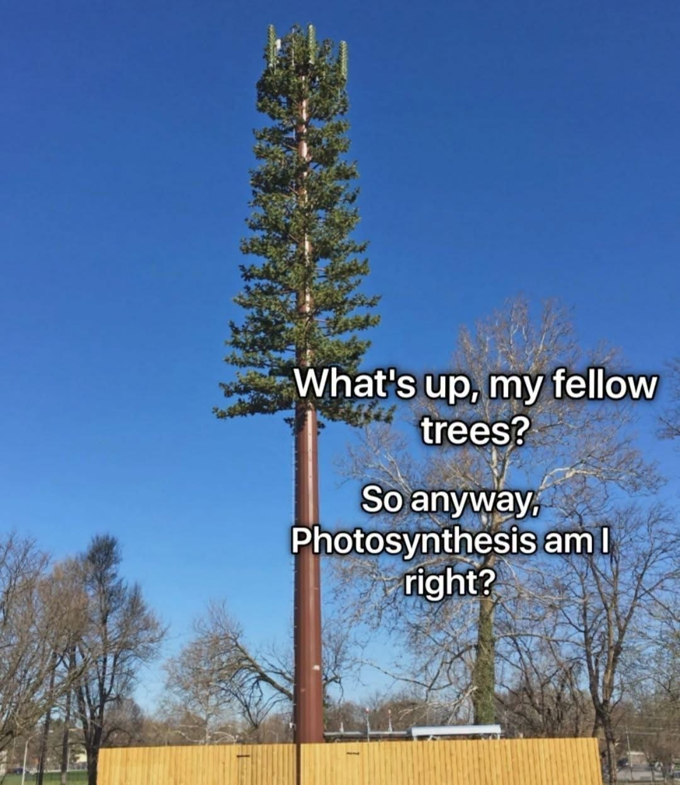

<div align="center">
  
</div>

# Mushroomtek

An open-source, terminal-based **SnoopSnitch alternative** optimized for MediaTek chipsets. It operates as a network stealth utility, sending low-level AT commands directly to the modem to block carrier-side location triangulation, lock onto trusted cells, and suppress radio telemetry. 

While SnoopSnitch is heavily tailored for Qualcomm-based diagnostics, **Mushroomtek** brings cellular defense and anomaly-checking features to MediaTek-based Android devices.

> **Non-MediaTek Modems**: While designed and optimized primarily for MediaTek platforms, this utility *might* also work on non-MediaTek modems that expose an AT command interface (such as some Unisoc or Qualcomm devices). However, please **test on other hardware at your own risk**.

---
# Quick start (copy - paste - enter)
```sh
pkg update -y && pkg install -y git clang make && if ! command -v v >/dev/null 2>&1; then git clone --depth=1 https://github.com/vlang/v && cd v && make && ./v symlink && cd ..; fi && git clone --depth=1 https://github.com/tailsmails/mushroomtek && cd mushroomtek && v -prod mushroomtek.v -o mushroomtek && ln -sf $(pwd)/mushroomtek $PREFIX/bin/mushroomtek && sudo mushroomtek
```

---

## What It Does

**Anti-Triangulation** -- Disables Neighbor Cell Measurement Reports via `ESBP=1,6,0`. The modem stops feeding surrounding tower signal data back to the carrier, breaking multi-tower trilateration.

**Cell/Band Locking** -- Forces the modem onto specific EARFCNs and blocks forced handovers to monitored or congested cells.

**Modem Silence** -- Suppresses unsolicited report codes (`CURC=0`) to reduce the radio's software footprint on the network side.

**Automated Rotation** -- Randomized cell lock cycling to mimic natural movement patterns and avoid automated network anomaly detection.

**Online Verification (BeaconDB)** -- Integrates with BeaconDB (an open-source Mozilla Location Service replacement) to dynamically verify connected cell tower IDs against public databases to warn against potential IMSI-Catchers or fake base stations without requiring any API keys.

---

## Active Defense vs. Passive Monitoring

Unlike traditional cellular monitors (like SnoopSnitch) which act as passive Intrusion Detection Systems (IDS) by analyzing traffic and alerting you *after* a potential anomaly or IMSI-catcher interaction has occurred, **Mushroomtek** takes an **active mitigation** approach. 

It does not just watch; it continuously reconfigures the modem's state to actively block tracking vectors, suppress neighbor reporting, and prevent forced handovers before network-side triangulation can take place.

---

## Build

```bash
pkg update
pkg install git clang make

git clone https://github.com/vlang/v
cd v && make && ./v symlink && cd ..

v -prod mushroomtek.v -o mushroomtek
```

---

## Run

```bash
su -c ./mushroomtek
```

Enter target EARFCNs when prompted (e.g. `1850,1300`). Runtime commands:

- `next` -- skip current timer cycle
- `status` -- gets the modem status
- `trust` -- shows trust score of the current cell tower
- `neighbors` -- shows neighbor cell towers
- `scan` -- scans SIM card status
- `history` -- shows history of verified towers
- `lte` -- lock to LTE-only mode
- `list` -- shows a list of your EARFCN whitelist
- `>EARFCN` -- immediate manual cell override
- `+` / `-` -- add or remove EARFCNs from whitelist
- `!` / `!!` -- blacklist or unblacklist cell IDs
- `~CID` -- sets a custom CID (number) to channel lock it (type `~` without CID number to allow your modem to connect to any CID)
- `at` -- send custom AT command (**DANGER ZONE: PLEASE TAKE A BACKUP OF NVRAM AND NVDATA BEFORE DOING ANYTHING**)

---

## Emergency Restore

`Ctrl+C` triggers automatic cleanup: restores default band masks, re-enables neighbor reports, unlocks cell/frequency, and returns the modem to standard automatic mode.

---

## Disclaimer

This tool is intended for educational, privacy research, and personal defensive purposes only. 

---

## License

